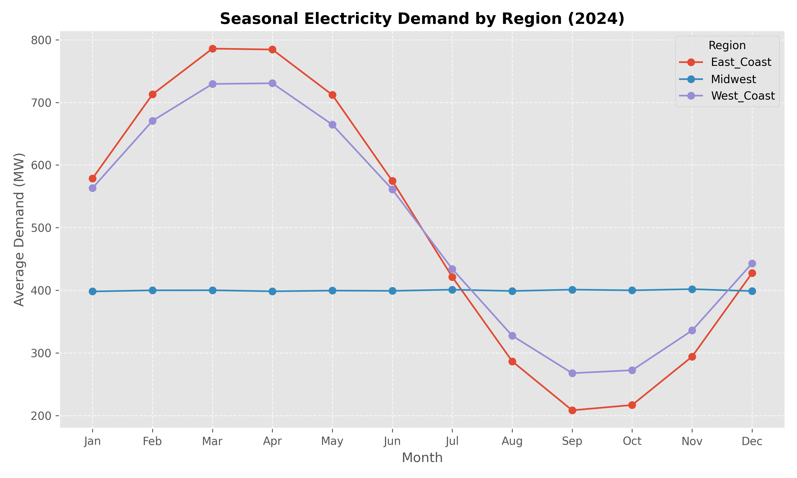
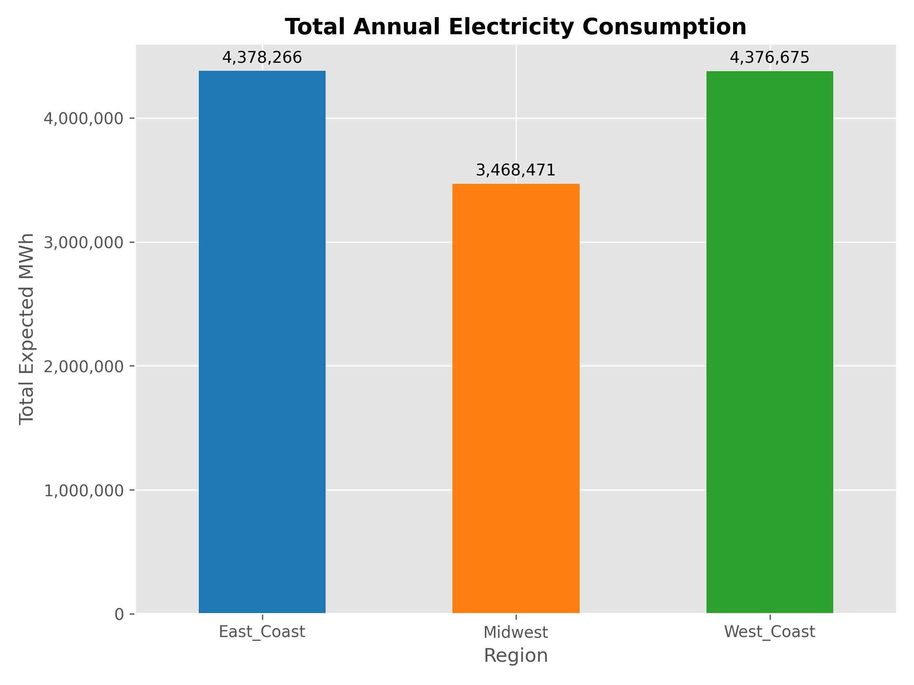

# Energy Consumption Analytics Dashboard

## Project Overview
This project builds an end-to-end data pipeline and analytics dashboard for electricity consumption data across multiple regions (East Coast, West Coast, Midwest). It addresses real-world, enterprise-level data challenges such as inconsistent formatting, dropped queries, and missing values in publicly available datasets.

**Tech Stack:** Python, Pandas, SQL (SQLite), Matplotlib, Excel

---

## What the Pipeline Does
1. **Data Generation:** Simulates messy, real-world hourly electricity load data complete with structural errors, missing timestamps, and intense statistical outliers.
2. **Ingestion:** Loads the raw, dirty unstructured files into a local SQLite Database (`energy_data.db`).
3. **ETL Cleaning:** Uses Python and Pandas to connect to SQL, interpolate missing holes, handle extreme anomalies (e.g. negative megawatts), and standardize column mapping across all three regions. 
4. **Analysis & Visualization:** Computes the top 50 demand peak hours and seasonal monthly usage curves, exporting those trends into visually distinct line and bar charts.
5. **Dashboard Generation:** Automatically compiles the insights into an accessible Excel dashboard (`Energy_Dashboard.xlsx`) via native Python automation.

---

## How to Run the Project
To demonstrate the full pipeline from raw data to the final dashboard, run the scripts in your terminal in this exact order:

### 1. Set up the Environment
If you haven't already, activate your virtual environment and install the required dependencies:
```bash
python -m venv venv
.\venv\Scripts\activate      # On Windows
pip install -r requirements.txt
```

### 2. Generate the Raw Data
Run the data generator to create the messy regional data. This will create a `data/raw/` directory containing the corrupted CSVs.
```bash
python generate_data.py
```

### 3. Ingest into SQL Database
Run the ingestion script to load the messy CSVs into a local SQL database without altering them. This proves the data can move from cold storage to DB successfully.
```bash
python db_setup.py
```

### 4. Clean the Data (ETL)
Run the cleaning pipeline. This scans the raw SQL tables, cleans the anomalies, interpolates the missing data, standardizes regions, and spits out a pristine `Cleaned_Energy_Data.xlsx` file. It also pushes the clean data back to a new `clean_energy_data` table in the database.
```bash
python clean_data.py
```

### 5. Analyze and Build the Dashboard
Finally, run the visualization script. This accesses the clean data array, calculates seasonal averages, highlights the top 50 stress-peaks, and generates `seasonal_trends.png` and `total_consumption.png`. It packages everything into a final `dashboard/Energy_Dashboard.xlsx`.
```bash
python analyze_and_visualize.py
```

---

## Sample Visualization Previews

When you run the pipeline, the following charts are generated dynamically in the `dashboard/` directory:

### Seasonal Electricity Demand by Region


### Total Annual Electricity Consumption


---

## How to Upload to GitHub

Follow these steps to upload this project to your GitHub account:

1. **Initialize Git and Commit Files** (Initialization is already done!):
   Run the following commands in your terminal to stage and commit the project files:
   ```bash
   git add .
   git commit -m "Initial commit: Energy analytics pipeline and interactive FastAPI dashboard"
   ```

2. **Create a New Repository on GitHub**:
   - Open your browser and go to [github.com/new](https://github.com/new) (log in if you haven't already).
   - Name your repository (e.g., `energy-consumption-dashboard`).
   - Keep the repository **Public** (or Private if preferred).
   - **Important:** Do *not* check any boxes under "Initialize this repository with" (no README, no .gitignore, no license). We already have these files.
   - Click the green **Create repository** button.

3. **Link the Local Repository and Push**:
   Copy the commands from the GitHub instruction page under "or push an existing repository from the command line" and run them:
   ```bash
   git branch -M main
   git remote add origin https://github.com/YOUR_GITHUB_USERNAME/YOUR_REPO_NAME.git
   git push -u origin main
   ```
   *(Be sure to replace `YOUR_GITHUB_USERNAME` and `YOUR_REPO_NAME` with your actual GitHub username and the repository name you just created!)*

---

## Final Analytical Report
After running the pipeline, review `analytical_report.md` for a complete executive summary of what the data revealed and specifically where the 3 areas for structural efficiency gains exist.

